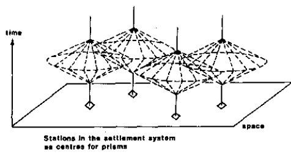

Карта является инструментом, который преобразует абстрактные пространственные отношения в конкретные, доступные для восприятия и анализа образы. В работе *«Метакартография»* Александра Фёдоровича Асланикашвили подчёркивается, что всё содержание карты можно рассматривать как единство двух сторон действительности — пространства и содержания, диалектическое единство которых не позволяет достоверно отразить их по отдельности, в отрыве друг от друга.

Кроме того, любое картографическое изображение относится к конкретному моменту времени, *локализуя своё содержание* в определённой временной системе отсчёта. И действительно, физическая среда, в которой мы живём, состоит не только из легко наблюдаемой пространственной оболочки — с ней неразрывно связан и временной компонент. Этот компонент может и не проявляться столь наглядно, однако он является неотъемлемой частью реальности. Подобно тому как автомобиль без двигателя теряет способность к движению и, соответственно, смысл, так и пространство без времени утрачивает динамику и возможность развития.

Любой, даже самый простой, акт перемещения в пространстве требует затрат определённого количества времени. Можно сказать, что время представляет собой своего рода ресурс, не уступающий пространству по значимости. Подобно тому как человек отводит пространство под различные нужды (строительство, рекреация, сельское хозяйство), он также выделяет определённые срезы своего времени, ограниченного рамками суточной активности или продолжительности жизни. Таким образом, время на карте выступает не только как система отсчёта, локализующая пространственные отношения, но и наоборот — пространство может служить системой отсчёта, локализующей доступность временных ресурсов. Развитию такого взгляда на пространство-время в географии мы во многом обязаны Лундской школе хроногеографии во главе с Торстеном Хагерстрандом.

  
*Рисунок 1. Временные ограничения "призмы", локализованные в пространстве*

Несмотря на несколько "эзотерический" и антропоцентричный характер хроногеографии, не позволяющей ей стать хоть сколько-нибудь доминирующим подходом в картографии, её идеи оказали значительное влияние на развитие современных представлений о пространственно-временных моделях в геоинформатике, транспортном планировании и урбанистике. Хроногеография расширила границы традиционного картографического мышления, напомнив о том, что за каждым пространственным объектом скрываются временные процессы, а за каждым перемещением — история выбора и ограничения. Сегодня, когда всё больше данных фиксируется в реальном времени и отражается в интерактивных картах, интеграция временного измерения становится не просто возможной, но необходимой. Пространство и время в таких системах — неотделимы, как форма и движение, [и в этом, пожалуй, заключается главный урок хроногеографии: карта — это не только образ места, но и след времени](https://avatars.dzeninfra.ru/get-zen_doc/271828/pub_65fe954dfcd3e83245c7ea41_65fe95841260c2025919cfd7/scale_1200).
